# TetraTrack Data Model Architecture

## Entity-Relationship Diagram

```mermaid
erDiagram
    %% ─── RIDING DOMAIN ───
    Horse ||--o{ Ride : "has many"
    Horse ||--o{ Competition : "competes in"
    Ride ||--o{ LocationPoint : "has many"
    Ride ||--o{ GaitSegment : "has many"
    Ride ||--o{ ReinSegment : "has many"
    Ride ||--o{ GaitTransition : "has many"
    Ride ||--o{ RidePhoto : "has many"
    Ride ||--o{ RideScore : "has many"

    %% ─── RUNNING DOMAIN ───
    RunningSession ||--o{ RunningSplit : "has many"
    RunningSession ||--o{ RunningInterval : "has many"
    RunningSession ||--o{ RunningLocationPoint : "has many"

    %% ─── SWIMMING DOMAIN ───
    SwimmingSession ||--o{ SwimmingLap : "has many"
    SwimmingSession ||--o{ SwimmingInterval : "has many"
    SwimmingSession ||--o{ SwimmingLocationPoint : "has many"

    %% ─── SHOOTING DOMAIN ───
    ShootingSession ||--o{ ShootingEnd : "has many"
    ShootingEnd ||--o{ Shot : "has many"

    %% ─── COMPETITION DOMAIN ───
    Competition ||--o{ CompetitionTask : "has many"

    %% ─── WORKOUT TEMPLATES ───
    WorkoutTemplate ||--o{ WorkoutBlock : "has many"

    %% ─── ENTITIES ───
    Horse {
        UUID id
        String name
        String breed
        Date dateOfBirth
        Double weight
        Double heightHands
        Data photoData
        Bool isArchived
        Data learnedGaitParametersData
    }

    Ride {
        UUID id
        Date startDate
        Date endDate
        Double totalDistance
        Double totalDuration
        String name
        String rideTypeValue
        Double elevationGain
        Double totalLeftAngle
        Double totalRightAngle
        Double averageHeartRate
        Data aiSummaryData
        Data startWeatherData
    }

    LocationPoint {
        UUID id
        Double latitude
        Double longitude
        Double altitude
        Date timestamp
        Double speed
    }

    GaitSegment {
        UUID id
        String gaitType
        Date startTime
        Date endTime
        Double distance
        Double averageSpeed
        String leadValue
        Double rhythmScore
    }

    ReinSegment {
        UUID id
        String direction
        Date startTime
        Date endTime
    }

    GaitTransition {
        UUID id
        String fromGait
        String toGait
        Date timestamp
        Double quality
    }

    RidePhoto {
        UUID id
        String localIdentifier
        Date capturedAt
        Double latitude
        Double longitude
    }

    RideScore {
        UUID id
        Int relaxation
        Int impulsion
        Int straightness
        Int rhythm
        Int riderPosition
        String notes
    }

    RunningSession {
        UUID id
        Date startDate
        Date endDate
        String sessionTypeRaw
        String runModeRaw
        Double totalDistance
        Double totalDuration
        Double averageCadence
        Double averageHeartRate
        Data startWeatherData
    }

    RunningSplit {
        UUID id
        Int orderIndex
        Double distance
        Double duration
        Double cadence
        Double heartRate
    }

    RunningInterval {
        UUID id
        Int orderIndex
        String name
        Double targetDistance
        Double targetPace
        Bool isCompleted
    }

    RunningLocationPoint {
        UUID id
        Double latitude
        Double longitude
        Date timestamp
        Double speed
    }

    SwimmingSession {
        UUID id
        Date startDate
        Date endDate
        String poolModeRaw
        Double poolLength
        Double totalDistance
        Double totalDuration
        Int totalStrokes
        Double averageHeartRate
    }

    SwimmingLap {
        UUID id
        Int orderIndex
        Date startTime
        Date endTime
        Double distance
        Int strokeCount
        String strokeRaw
    }

    SwimmingInterval {
        UUID id
        Int orderIndex
        String name
        Double targetDistance
        Bool isCompleted
    }

    SwimmingLocationPoint {
        UUID id
        Double latitude
        Double longitude
        Date timestamp
    }

    ShootingSession {
        UUID id
        Date startDate
        Date endDate
        String sessionContextRaw
        String targetTypeRaw
        Double distance
        Int numberOfEnds
        Double averageStanceStability
    }

    ShootingEnd {
        UUID id
        Int orderIndex
        Date startTime
        Date endTime
        UUID targetScanAnalysisID
    }

    Shot {
        UUID id
        Int orderIndex
        Int score
        Bool isX
        Double positionX
        Double positionY
    }

    Competition {
        UUID id
        String name
        Date date
        Date endDate
        String venue
        String competitionTypeRaw
        String levelRaw
        Bool isEntered
        Bool isCompleted
        Int shootingScore
        Double swimmingTime
        Double runningTime
        Int ridingScore
        Data weatherData
    }

    CompetitionTask {
        UUID id
        String title
        Date dueDate
        Bool isCompleted
        String priorityRaw
        String categoryRaw
    }

    WorkoutTemplate {
        UUID id
        String name
        String disciplineRaw
        String difficultyRaw
        Int estimatedDuration
        Bool isBuiltIn
    }

    WorkoutBlock {
        UUID id
        String name
        Int durationSeconds
        String targetGaitRaw
        String intensityRaw
        Int orderIndex
    }
```



## Domain Summary

The data model is organized into **6 domains** with a consistent pattern:
each discipline has a **session** entity that owns child detail records.

### 1. Riding (most complex)
```
Horse ──┬── Ride ──┬── LocationPoint (GPS breadcrumbs)
        │          ├── GaitSegment (walk/trot/canter/gallop periods)
        │          ├── ReinSegment (left/right/straight periods)
        │          ├── GaitTransition (gait change events)
        │          ├── RidePhoto (PHAsset references)
        │          └── RideScore (subjective 1-5 ratings)
        │
        └── Competition
```
- **Horse** is the only entity shared across domains (Ride + Competition)
- Rides store extensive biomechanical data as encoded JSON blobs (weather, AI summaries, stride metrics, gait diagnostics)

### 2. Running
```
RunningSession ──┬── RunningSplit (per-km splits)
                 ├── RunningInterval (structured workout intervals)
                 └── RunningLocationPoint (GPS breadcrumbs)
```

### 3. Swimming
```
SwimmingSession ──┬── SwimmingLap (per-length laps)
                  ├── SwimmingInterval (structured intervals)
                  └── SwimmingLocationPoint (open-water GPS)
```

### 4. Shooting
```
ShootingSession ── ShootingEnd ── Shot
                        │
                        └── references TargetScanAnalysis (by UUID, not relationship)
```
- **TargetScanAnalysis** is a standalone entity (no @Relationship) linked by UUID — this is because scan analyses can exist independently of sessions

### 5. Competitions
```
Competition ── CompetitionTask
     │
     └── Horse (optional)
```
- Stores results for all four disciplines (shooting score, swimming time, running time, riding score) plus calculated points

### 6. Standalone Entities (no parent relationships)
| Entity | Purpose |
|--------|---------|
| **RiderProfile** | Physical stats (weight, height, HR zones) |
| **AthleteProfile** | Rolling 30-day skill averages across all disciplines |
| **SkillDomainScore** | Individual skill domain measurements |
| **FatigueIndicator** | HRV-based recovery readiness |
| **FlatworkExercise / PoleworkExercise** | Reusable arena exercises |
| **UnifiedDrillSession / RidingDrillSession / ShootingDrillSession** | Drill practice records |
| **TrainingStreak / ScheduledWorkout / TrainingWeekFocus** | Training planning |
| **TargetScanAnalysis** | Camera-scanned target card results |
| **DownloadedRegion / OSMNode / PlannedRoute / RouteWaypoint** | Offline route planning |
| **TrainingArtifact / SharedCompetition / SharingRelationship / LinkedRiderRecord** | CloudKit family sharing |
| **LiveTrackingSession / FamilyMember** | Real-time location sharing |

## Design Patterns

1. **JSON-blob storage** — Complex data (weather, AI summaries, heart rate samples, gait diagnostics) stored as `Data` properties with computed getters that decode on access. Avoids extra entities and keeps CloudKit compatible.

2. **Enum-as-String** — All enums stored as raw `String` values (e.g. `rideTypeValue`, `competitionTypeRaw`) for CloudKit compatibility.

3. **Optional relationships with `?`** — All `@Relationship` arrays use `[Type]?` (CloudKit requirement). Accessed via `(relationship ?? [])`.

4. **Cascade deletes** — All parent→child relationships use `.cascade` delete rule.

5. **PHAsset references** — Photos/videos store Apple Photos asset identifiers, not image data.

6. **UUID foreign keys** — Some cross-domain links use stored UUIDs rather than @Relationship (e.g. `ShootingEnd.targetScanAnalysisID`).
