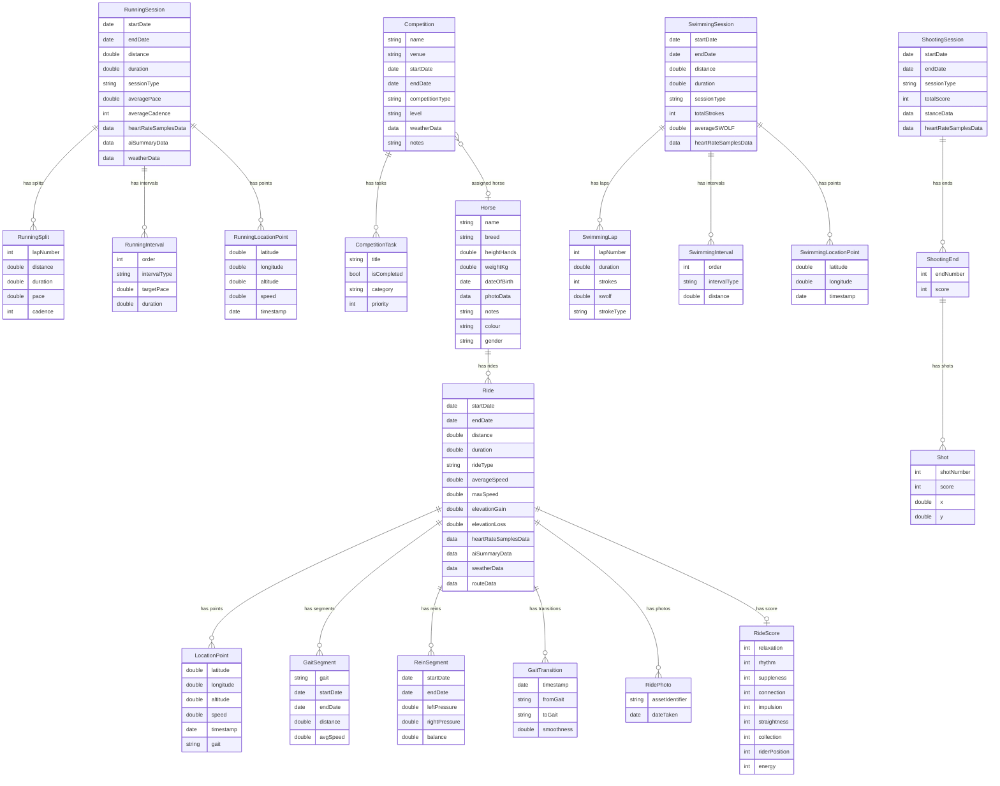

# TetraTrack Architecture

## Overview

TetraTrack is a multi-discipline training app targeting tetrathlon and eventing athletes. It uses physics-based signal processing (FFT, HMM, coherence analysis) to extract biomechanical metrics from IMU sensors, rather than simple heuristics.

**Platforms:** iOS 17+ (primary), watchOS 10+ (companion), iPadOS (review-only), WidgetKit
**Persistence:** SwiftData with CloudKit sync (`iCloud.dev.dreamfold.TetraTrack`)
**AI:** FoundationModels framework (iOS 26+) for on-device intelligence

---

## Data Model

### Entity-Relationship Diagram


```mermaid
erDiagram
    %% ── Riding Domain ──
    Horse {
        string name
        string breed
        double heightHands
        double weightKg
        date dateOfBirth
        data photoData
        string notes
        string colour
        string gender
    }
    Ride {
        date startDate
        date endDate
        double distance
        double duration
        string rideType
        double averageSpeed
        double maxSpeed
        double elevationGain
        double elevationLoss
        data heartRateSamplesData
        data aiSummaryData
        data weatherData
        data routeData
    }
    LocationPoint {
        double latitude
        double longitude
        double altitude
        double speed
        date timestamp
        string gait
    }
    GaitSegment {
        string gait
        date startDate
        date endDate
        double distance
        double avgSpeed
    }
    ReinSegment {
        date startDate
        date endDate
        double leftPressure
        double rightPressure
        double balance
    }
    GaitTransition {
        date timestamp
        string fromGait
        string toGait
        double smoothness
    }
    RidePhoto {
        string assetIdentifier
        date dateTaken
    }
    RideScore {
        int relaxation
        int rhythm
        int suppleness
        int connection
        int impulsion
        int straightness
        int collection
        int riderPosition
        int energy
    }

    Horse ||--o{ Ride : "has rides"
    Ride ||--o{ LocationPoint : "has points"
    Ride ||--o{ GaitSegment : "has segments"
    Ride ||--o{ ReinSegment : "has reins"
    Ride ||--o{ GaitTransition : "has transitions"
    Ride ||--o{ RidePhoto : "has photos"
    Ride ||--o| RideScore : "has score"

    %% ── Running Domain ──
    RunningSession {
        date startDate
        date endDate
        double distance
        double duration
        string sessionType
        double averagePace
        int averageCadence
        data heartRateSamplesData
        data aiSummaryData
        data weatherData
    }
    RunningSplit {
        int lapNumber
        double distance
        double duration
        double pace
        int cadence
    }
    RunningInterval {
        int order
        string intervalType
        double targetPace
        double duration
    }
    RunningLocationPoint {
        double latitude
        double longitude
        double altitude
        double speed
        date timestamp
    }

    RunningSession ||--o{ RunningSplit : "has splits"
    RunningSession ||--o{ RunningInterval : "has intervals"
    RunningSession ||--o{ RunningLocationPoint : "has points"

    %% ── Swimming Domain ──
    SwimmingSession {
        date startDate
        date endDate
        double distance
        double duration
        string sessionType
        int totalStrokes
        double averageSWOLF
        data heartRateSamplesData
    }
    SwimmingLap {
        int lapNumber
        double duration
        int strokes
        double swolf
        string strokeType
    }
    SwimmingInterval {
        int order
        string intervalType
        double distance
    }
    SwimmingLocationPoint {
        double latitude
        double longitude
        date timestamp
    }

    SwimmingSession ||--o{ SwimmingLap : "has laps"
    SwimmingSession ||--o{ SwimmingInterval : "has intervals"
    SwimmingSession ||--o{ SwimmingLocationPoint : "has points"

    %% ── Shooting Domain ──
    ShootingSession {
        date startDate
        date endDate
        string sessionType
        int totalScore
        data stanceData
        data heartRateSamplesData
    }
    ShootingEnd {
        int endNumber
        int score
    }
    Shot {
        int shotNumber
        int score
        double x
        double y
    }

    ShootingSession ||--o{ ShootingEnd : "has ends"
    ShootingEnd ||--o{ Shot : "has shots"

    %% ── Competition Domain ──
    Competition {
        string name
        string venue
        date startDate
        date endDate
        string competitionType
        string level
        data weatherData
        string notes
    }
    CompetitionTask {
        string title
        bool isCompleted
        string category
        int priority
    }

    Competition ||--o{ CompetitionTask : "has tasks"
    Competition }o--o| Horse : "assigned horse"
```

### Design Patterns

| Pattern | Usage |
|---------|-------|
| **JSON-blob storage** | Complex types encoded as `Data?` (heart rate samples, AI summaries, weather) |
| **Enum-as-String** | All enums stored as raw strings for CloudKit compatibility |
| **Optional relationships** | All `@Relationship` arrays use `[Type]?` (CloudKit requirement) |
| **Cascade deletes** | Parent deletion cascades to children (LocationPoints, Splits, etc.) |
| **PHAsset references** | Photos stored as asset identifiers, not image data |
| **UUID foreign keys** | Cross-domain links use UUID strings |

### CloudKit Requirements

```swift
// All properties MUST have defaults or be optional
var name: String = ""
var endDate: Date?

// Relationships MUST be optional arrays
@Relationship(deleteRule: .cascade, inverse: \LocationPoint.ride)
var locationPoints: [LocationPoint]? = []  // Note the ?

// NEVER use @Attribute(.unique) — breaks CloudKit sync
```

---

## Service Architecture

### Core Services

| Service | Pattern | Purpose |
|---------|---------|---------|
| `RideTracker` | `@Observable` | Orchestrates active ride sessions |
| `LocationManager` | `@Observable` | CoreLocation with `CLLocationUpdate.liveUpdates(.fitness)` |
| `ServiceContainer` | Protocol DI | Dependency injection for testability |
| `WatchConnectivityManager` | Singleton | Watch <-> phone messaging |
| `AudioCoachManager` | Singleton | Voice coaching via AVSpeechSynthesizer |
| `LocalizationManager` | Singleton | Runtime language switching |

### Signal Processing (DSP)

| Service | Algorithm | Purpose |
|---------|-----------|---------|
| `FFTProcessor` | Fast Fourier Transform | Frequency extraction from accelerometer data |
| `GaitHMM` | Hidden Markov Model | Gait state classification with transition constraints |
| `CoherenceAnalyzer` | Spectral coherence | Signal quality and coupling assessment |
| `HilbertTransform` | Analytic signal | Phase extraction for lead detection |
| `FrameTransformer` | Rotation matrices | Phone-to-horse coordinate transformation |

### Discipline Services

**Riding (13 services):**
`GaitAnalyzer`, `LeadAnalyzer`, `ReinAnalyzer`, `TurnAnalyzer`, `SymmetryAnalyzer`, `RhythmAnalyzer`, `HorseRoutingEngine`, `HorseStatisticsManager`, `RideHealthCoordinator`, `RideWatchBridge`, `MotionManager`, `GaitLearningService`, `PostSessionSummaryService`

**Running (7 services):**
`LapDetector`, `VirtualPacer`, `TrainingProgramService`, `ProgramAudioCoach`, `RouteMatchingService`, `SegmentPBAnalyzer`, `WalkingAnalysisService`

**Shooting (8+ services):**
`EnhancedTargetScanner`, `AssistedHoleDetector`, `PatternAnalyzer`, `ShootingSensorAnalyzer`, `ShootingHistoryService`, `TargetThumbnailService` + Detection/ and MLTraining/ subdirectories

**Swimming:** Integrated into session tracking views with Apple Watch stroke detection

### Training & Analytics

| Service | Purpose |
|---------|---------|
| `TrainingLoadService` | CTL/ATL/TSB performance management |
| `CoachingEngine` | Real-time coaching cues |
| `DrillScorer` | Drill performance scoring |
| `AdaptiveDifficultyService` | Progressive drill difficulty |
| `CrossSportCorrelationService` | Cross-discipline transfer analysis |
| `TrendAnalyzer` | Long-term performance trends |

### Intelligence (iOS 26+)

| Service | Purpose |
|---------|---------|
| `IntelligenceService` | FoundationModels integration |
| `AIDataCollector` | Data preparation for AI analysis |

Features: ride summaries, training pattern analysis, personalised recommendations, ride comparison, competition insights, recovery analysis. Uses `@Generable` structured responses.

### Sharing & CloudKit

| Service | Purpose |
|---------|---------|
| `UnifiedSharingCoordinator` | Master CloudKit sharing orchestrator |
| `ArtifactSyncService` | Cross-device training data sync |
| `ShareConnectionService` | Family sharing connections |
| `LiveTrackingService` | Real-time location sharing |
| `SafetyAlertService` | Fall detection alert distribution |
| `FallDetectionManager` | 2-phase fall detection algorithm |

---

## Signal Processing Pipeline

### Gait Analysis

The app measures horse gait, rider balance, and movement quality using rider-mounted IMU sensors (iPhone + Apple Watch).

**Sensor Input:** CoreMotion at ~100Hz (userAcceleration, rotationRate, attitude)

**Processing Pipeline:**
```
CoreMotion -> FrameTransformer (phone-to-horse coordinates)
    -> Window-based FFT (2.5s windows, 80% overlap)
    -> Feature extraction (Z, X, Y acceleration + yaw/roll rate)
    -> Spectral analysis (Pz, Px, Pyaw)
    -> Stride frequency detection (0.5-6Hz)
    -> Harmonic ratios (H2, H3)
    -> Coherence analysis
    -> HMM classification (walk/trot/canter/gallop)
```

**Horse Profile Calibration:** Age, weight, height, and breed parameters scale stride thresholds, normalise signals, estimate speed, and provide breed-specific frequency priors.

**Gait Classification:** Feature vector includes stride frequency (f0), harmonic ratios (H2, H3), spectral entropy, and coherence. The HMM constrains transitions to physically possible sequences (e.g., no walk->gallop). Updates at 2-4Hz.

**Canter Lead Detection:** Phase difference between lateral acceleration (Y) and yaw rate via Hilbert transform. +/-90 degrees indicates left/right lead.

**Balance Metrics:**
- Rein balance: RMS of positive/negative lateral acceleration, ratio metric
- Turn balance: measured vs expected centripetal acceleration
- Straightness: mean yaw rate and lateral acceleration
- Lead quality: vertical-yaw coherence x lead phase magnitude
- Rider symmetry: Apple Watch accelerometer data

**Session Outputs:** Rhythm/regularity scores, transition quality ratings, lead consistency percentages, symmetry indices, bend quality metrics.

### Running Motion Analysis

iPhone-based motion analysis at 100Hz in pocket mode, reusing the DSP components.

**Features:**
1. **Cadence detection** -- FFT peak in 1.2-3.5Hz range, mapped to steps/min
2. **Gait phase classification** -- Walking/jogging/running/sprinting based on cadence + vertical oscillation thresholds, confirmed by GPS
3. **Vertical oscillation** -- Double-integration of vertical acceleration with high-pass drift removal
4. **Ground contact time** -- Acceleration asymmetry and duty cycle analysis
5. **Left-right asymmetry** -- Lateral acceleration peak comparison, asymmetry index
6. **Impact loading** -- Peak acceleration magnitude and loading rate trends
7. **Form degradation** -- Composite score from 5 metrics compared to session baseline, audio alerts when declining
8. **Treadmill step counting** -- Step detection + stride length estimation for GPS-free distance
9. **Running power** -- Three-component estimate (horizontal, vertical, lateral) for metabolic efficiency

---

## Ride Insights View

Visual layout specification for post-ride analysis:

1. **Header Summary** -- Rhythm, Lead Quality, Effort scores as horizontal progress bars (0-100%, colour-coded green/yellow/red)
2. **Gait Timeline** -- Horizontal time axis with gait-coloured segments, canter lead arrows, tap for stride frequency
3. **Rein & Turn Balance** -- Stacked line graphs (positive=left/inward, negative=right/outward) with green/yellow/red zones
4. **Rider Symmetry** -- Line chart with threshold violation shading, summary statistics
5. **Rhythm & Stability** -- Heatmap of stride timing irregularity, colour intensity = deviation
6. **Transition Quality** -- Mini timeline of gait transitions, colour-coded by smoothness
7. **Lead Consistency** -- Pie chart (correct lead vs cross-canter) with coupling score overlay
8. **Interactive** -- Tap to highlight correlations, zoom along duration, swipe to compare segments

---

## Training Philosophy: Cross-Sport Transfer

TetraTrack measures athlete movement across disciplines using a unified biomechanics framework, not just sport-specific metrics.

### Six Pillars of Movement

| Pillar | Riding | Running | Swimming | Shooting |
|--------|--------|---------|----------|----------|
| **Stability** | Trunk steadiness | Core engagement | Streamline hold | Stance steadiness |
| **Balance** | Rein/turn balance | Left-right symmetry | Stroke symmetry | Weight distribution |
| **Symmetry** | Lead consistency | Gait asymmetry | Bilateral stroke | Stance alignment |
| **Rhythm** | Stride regularity | Cadence consistency | Stroke rate | Breathing rhythm |
| **Endurance** | HR recovery | Pace maintenance | SWOLF consistency | Hold duration |
| **Calmness** | HR variability | Form under fatigue | Stroke smoothness | Tremor control |

### Cross-Sport Transfer Examples

- Balance board drill -> improved running left-right symmetry
- Breathing exercises -> improved swimming stroke consistency
- Core stability drill -> improved shooting stance steadiness
- Hip mobility drill -> improved riding straightness

All metrics are physics-derived from IMU sensors and GPS -- not subjective assessments.

---

## Shooting Target Analysis

Stadium geometry (Build 67+) uses stadium shapes for ring boundaries instead of ellipses. Implementation in `TargetGeometry.swift` and `RingAwareAnalyzer.swift`.

---

## Key Architectural Decisions

### Timer Implementation
Wall-clock time throughout: store `startDate = Date()` at start, compute elapsed as `Date().timeIntervalSince(startDate)`. Milestone detection uses boundary crossing, not exact equality. Applied across 27+ session and drill screens.

### CloudKit Sync Strategy
Automatic sync via SwiftData's `cloudKitDatabase: .automatic`. Graceful fallback to local-only if CloudKit unavailable. All models designed for sync compatibility (optional relationships, default values, string enums).

### Encoded Data Fields
Complex types stored as `Data?` and decoded on access:
- `aiSummaryData` -> `SessionSummary`
- `heartRateSamplesData` -> `[HeartRateSample]`
- `weatherData` -> `WeatherConditions`

### Background Location
```swift
locationManager.allowsBackgroundLocationUpdates = true
locationManager.pausesLocationUpdatesAutomatically = false
locationManager.activityType = .fitness
```

### Watch Communication
- Real-time: `session.sendMessage()` (when reachable)
- State sync: `session.updateApplicationContext()` (last value wins)
- Queued commands: `session.transferUserInfo()` (guaranteed delivery)
