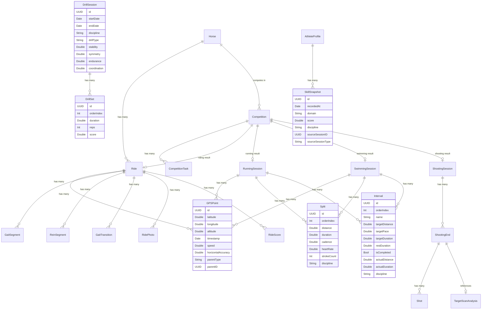

# TetraTrack — Optimized Future State Architecture

## Problem Statement

The current architecture grew organically discipline-by-discipline. Each discipline has its own model hierarchy, leading to significant duplication and friction when working across disciplines. The key symptoms:

| Problem | Current Impact |
|---------|---------------|
| 3 identical LocationPoint models | 47 lines duplicated; every GPS feature maintained 3x |
| 4 separate `@Query` in every history/stats view | Manual array concatenation, no predicate filtering |
| Competition stores flat scores, not session refs | Data goes stale; no single source of truth |
| 3 drill session models with near-identical schemas | 522 lines for same concept |
| `SessionStatistics` struct exists but is never used | Protocol abstractions defined but underutilized |
| TrainingArtifact duplicates session data for sharing | Manual marshalling; fields drift out of sync |

## Design Principles

1. **Model once, query anywhere** — shared base entities eliminate duplication
2. **Protocols for behaviour, models for storage** — keep the good protocol hierarchy, make models back it
3. **Competition is a container, sessions are the truth** — link, don't copy
4. **CloudKit stays happy** — optional relationships, default values, no `@Attribute(.unique)`
5. **Incremental migration** — each change is independently shippable

---

## Optimized Entity-Relationship Diagram



---

## Change-by-Change Breakdown

### Change 1: Unified GPSPoint

**Current:** 3 models — `LocationPoint`, `RunningLocationPoint`, `SwimmingLocationPoint` — with identical schemas.

**Future:** Single `GPSPoint` model with a discriminator.

```swift
@Model
final class GPSPoint {
    var id: UUID = UUID()
    var latitude: Double = 0
    var longitude: Double = 0
    var altitude: Double = 0
    var timestamp: Date = Date()
    var horizontalAccuracy: Double = 0
    var speed: Double = 0

    // Discriminator — which parent owns this point
    var parentType: String = ""   // "ride", "run", "swim"
    var parentID: UUID = UUID()

    // Optional back-references (only one is set)
    @Relationship var ride: Ride?
    @Relationship var runningSession: RunningSession?
    @Relationship var swimmingSession: SwimmingSession?
}
```

**Why discriminator + optional relationships (not one generic relationship):**
SwiftData doesn't support polymorphic relationships. Three optional back-references with only one populated is the CloudKit-compatible pattern. The `parentType`/`parentID` pair enables generic queries without knowing which relationship to follow.

**Impact:** Eliminates ~100 lines of duplication. One `CLLocation` extension. One map rendering path.

**Migration:** Write a lightweight migration that copies existing `RunningLocationPoint`/`SwimmingLocationPoint` rows into `GPSPoint`, setting `parentType` and the correct optional relationship. Remove old models after verification.

---

### Change 2: Unified Split

**Current:** `RunningSplit` and `SwimmingLap` — same concept (distance segment within a session), different names and slightly different fields.

**Future:** Single `Split` model.

```swift
@Model
final class Split {
    var id: UUID = UUID()
    var orderIndex: Int = 0
    var distance: Double = 0
    var duration: Double = 0

    // Optional metrics (set per discipline)
    var cadence: Double?          // running
    var heartRate: Double?        // running, swimming
    var elevation: Double?        // running
    var strokeCount: Int?         // swimming
    var strokeType: String?       // swimming

    var discipline: String = ""   // "run" or "swim"

    @Relationship var runningSession: RunningSession?
    @Relationship var swimmingSession: SwimmingSession?
}
```

**Why not also include Ride segments?** GaitSegments are fundamentally different — they represent detected gait *type* changes, not distance-based splits. They stay as-is.

---

### Change 3: Unified Interval

**Current:** `RunningInterval`, `SwimmingInterval`, `WorkoutBlock` — same shape.

**Future:** Single `Interval` model.

```swift
@Model
final class Interval {
    var id: UUID = UUID()
    var orderIndex: Int = 0
    var name: String = ""
    var targetDistance: Double?
    var targetPace: Double?
    var targetDuration: Double?
    var restDuration: Double?
    var isCompleted: Bool = false
    var actualDistance: Double?
    var actualDuration: Double?

    // Discipline-specific optional fields
    var actualCadence: Double?      // running
    var actualHeartRate: Double?    // running
    var actualStrokes: Int?         // swimming
    var targetGait: String?         // riding (WorkoutBlock)
    var intensity: String?          // riding (WorkoutBlock)

    var discipline: String = ""

    @Relationship var runningSession: RunningSession?
    @Relationship var swimmingSession: SwimmingSession?
    @Relationship var workoutTemplate: WorkoutTemplate?
}
```

---

### Change 4: Competition → Session References

**Current:** Competition stores flat scores:
```swift
var shootingScore: Int?
var swimmingTime: TimeInterval?
var runningTime: TimeInterval?
var ridingScore: Double?
```

**Future:** Competition links to the actual sessions that produced the results, with flat scores kept as a cache for offline/quick display.

```swift
// ADD these relationships to Competition:
@Relationship var competitionRide: Ride?
@Relationship var competitionRunningSession: RunningSession?
@Relationship var competitionSwimmingSession: SwimmingSession?
@Relationship var competitionShootingSession: ShootingSession?

// KEEP the flat score properties as computed caches
var shootingScore: Int? {
    get { storedShootingScore ?? competitionShootingSession?.totalScore }
    set { storedShootingScore = newValue }
}
```

**Impact:** Competition results now have a single source of truth. Editing a session updates competition stats. The flat `stored*` properties remain for CloudKit sync (computed properties don't sync) but are refreshed from the linked session when available.

---

### Change 5: Unified DrillSession

**Current:** `RidingDrillSession` (110 lines), `ShootingDrillSession` (192 lines), `UnifiedDrillSession` (220 lines) — 522 lines total for the same concept.

**Future:** Single `DrillSession` with a discipline tag and optional metrics.

```swift
@Model
final class DrillSession {
    var id: UUID = UUID()
    var startDate: Date = Date()
    var endDate: Date?
    var discipline: String = ""
    var drillType: String = ""
    var difficultyLevel: String = ""
    var notes: String = ""

    // Universal subscores (0-100)
    var stability: Double?
    var symmetry: Double?
    var endurance: Double?
    var coordination: Double?
    var breathing: Double?
    var rhythm: Double?
    var reaction: Double?

    // Shooting-specific
    var averageGroupSize: Double?
    var shotCount: Int?

    @Relationship(deleteRule: .cascade)
    var sets: [DrillSet]? = []
}

@Model
final class DrillSet {
    var id: UUID = UUID()
    var orderIndex: Int = 0
    var duration: Double = 0
    var reps: Int?
    var score: Double?

    @Relationship var session: DrillSession?
}
```

**Impact:** ~300 lines removed. One query for all drills. Filter by discipline with a predicate.

---

### Change 6: Typed SkillSnapshot (replaces SkillDomainScore)

**Current:** `SkillDomainScore` stores a `sourceSessionId: UUID?` with no way to navigate back to the source session without querying all 4 types.

**Future:** `SkillSnapshot` stores both the session UUID and a `sourceSessionType` discriminator.

```swift
@Model
final class SkillSnapshot {
    var id: UUID = UUID()
    var recordedAt: Date = Date()
    var domain: String = ""             // "stability", "balance", etc.
    var score: Double = 0
    var discipline: String = ""         // "riding", "running", etc.
    var sourceSessionID: UUID?
    var sourceSessionType: String = ""  // "Ride", "RunningSession", etc.
    var contributingMetrics: Data?      // encoded [String: Double]

    @Relationship var athleteProfile: AthleteProfile?
}
```

**Impact:** Can now navigate to the source. Recalculation is possible by querying by `sourceSessionType`. AthleteProfile computes rolling averages from `SkillSnapshot` queries instead of storing static denormalized values.

---

### Change 7: Cross-Discipline Query Service

**Current:** Every view that shows sessions across disciplines has 4 `@Query` properties and manual concatenation.

**Future:** A `SessionQueryService` that centralizes this.

```swift
@Observable
final class SessionQueryService {
    private let context: ModelContext

    /// Fetch all sessions in a date range, optionally filtered by discipline
    func sessions(
        from startDate: Date,
        to endDate: Date = .now,
        discipline: TrainingDiscipline? = nil
    ) -> [any TrainingSessionProtocol] {
        var results: [any TrainingSessionProtocol] = []

        if discipline == nil || discipline == .riding {
            let rides = try? context.fetch(
                FetchDescriptor<Ride>(predicate: #Predicate { $0.startDate >= startDate && $0.startDate <= endDate })
            )
            results.append(contentsOf: rides ?? [])
        }
        // ... same for running, swimming, shooting

        return results.sorted { $0.startDate > $1.startDate }
    }

    /// Unified statistics for any combination of disciplines
    func statistics(
        from startDate: Date,
        disciplines: Set<TrainingDiscipline> = Set(TrainingDiscipline.allCases)
    ) -> SessionStatistics {
        let all = sessions(from: startDate, discipline: nil)
            .filter { session in
                // Map session type to discipline
                disciplines.contains(discipline(for: session))
            }
        return SessionStatistics(sessions: all)
    }
}
```

**Impact:** Views drop from 4 `@Query` to 1 service call. Period filtering happens at the database level. `SessionStatistics` (currently unused) gets a reason to exist.

**Note:** This doesn't replace `@Query` for discipline-specific views (e.g. the Riding tab still queries Rides directly). It's for cross-discipline views like Training History, Dashboard, Insights.

---

### Change 8: TrainingArtifact as Projection

**Current:** `TrainingArtifact` manually copies fields from sessions into a shareable record.

**Future:** `TrainingArtifact` becomes a computed projection, auto-generated from the source session.

```swift
extension TrainingArtifact {
    /// Create artifact from any session conforming to TrainingSessionProtocol
    static func from(_ session: any TrainingSessionProtocol, discipline: TrainingDiscipline) -> TrainingArtifact {
        let artifact = TrainingArtifact()
        artifact.startTime = session.startDate
        artifact.endTime = session.endDate
        artifact.distance = session.totalDistance
        artifact.name = session.name
        artifact.disciplineRaw = discipline.rawValue

        // Discipline-specific data encoded via protocol extensions
        if let ride = session as? Ride {
            artifact.disciplineData = ride.encodeArtifactData()
        } else if let run = session as? RunningSession {
            artifact.disciplineData = run.encodeArtifactData()
        }
        // ...
        return artifact
    }
}

protocol ArtifactEncodable {
    func encodeArtifactData() -> Data?
}
```

**Impact:** Single creation path. When a session gains a new field, add it to `encodeArtifactData()` — no separate model to keep in sync.

---

## Migration Strategy

These changes can be shipped incrementally. Recommended order based on risk/reward:

| Phase | Change | Risk | Reward | Dependencies |
|-------|--------|------|--------|-------------|
| **A** | 7. SessionQueryService | None (additive) | High — immediately simplifies views | None |
| **B** | 5. Unified DrillSession | Low (drill data is regenerable) | Medium — removes 300 lines | None |
| **C** | 6. Typed SkillSnapshot | Low | Medium — enables recalculation | None |
| **D** | 1. Unified GPSPoint | Medium (data migration) | High — removes duplication | None |
| **E** | 2+3. Unified Split + Interval | Medium (data migration) | Medium | None |
| **F** | 4. Competition → Session refs | Medium (schema change) | High — single source of truth | None |
| **G** | 8. Artifact as projection | Low (sharing layer only) | Medium — eliminates drift | F |

**Phase A is zero-risk and immediately improves developer experience** — it's purely additive, wrapping existing queries in a service layer. Ship it first.

**Phases D-E require SwiftData migration** — back up the SQLite store, write `SchemaMigrationPlan` with a `MigrationStage.custom` block that copies rows from old models to new. Test on a copy of production data.

---

## What Stays The Same

Not everything needs changing. These parts of the current architecture are well-designed:

- **Ride and its children** (GaitSegment, ReinSegment, GaitTransition, RidePhoto, RideScore) — riding is genuinely different from other disciplines; the detailed biomechanical model is appropriate
- **Horse model** — correctly shared between Ride and Competition
- **ShootingSession → ShootingEnd → Shot** — three-level hierarchy is correct for the scoring domain
- **Protocol hierarchy** in SessionProtocol.swift — well-designed, just underutilised
- **JSON blob pattern** for weather, AI summaries, heart rate samples — avoids entity explosion
- **CloudKit compatibility patterns** — optional relationships, default values, cascade deletes

## Estimated Line Count Impact

| Area | Current Lines | Future Lines | Delta |
|------|-------------|-------------|-------|
| LocationPoint (×3) | ~200 | ~70 | **-130** |
| Split models (×2) | ~140 | ~60 | **-80** |
| Interval models (×3) | ~200 | ~70 | **-130** |
| Drill models (×3) | ~522 | ~160 | **-362** |
| Cross-discipline view queries | ~400 (across views) | ~50 (service) | **-350** |
| Competition score properties | ~80 | ~100 (adds refs) | +20 |
| SkillDomainScore → SkillSnapshot | ~90 | ~70 | **-20** |
| **Total** | | | **~-1,050 lines** |
