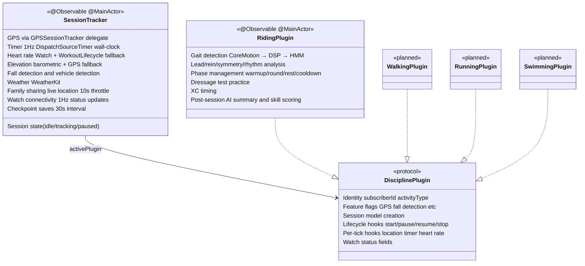
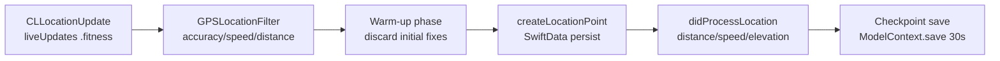
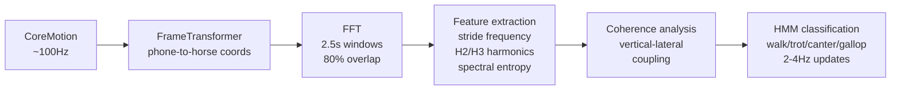
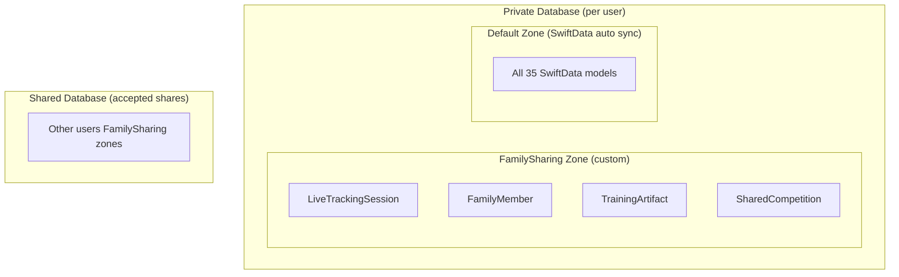

# TetraTrack

The complete training companion for tetrathlon and eventing athletes. Track riding, running, swimming, and shooting — with automatic gait detection, AI coaching, family safety, and Apple Watch integration.

**Platforms:** iOS 26+ (primary), watchOS 26+ (companion), iPadOS (review-only), WidgetKit
**Persistence:** SwiftData with CloudKit sync (`iCloud.dev.dreamfold.TetraTrack`)
**AI:** FoundationModels framework (iOS 26+) for on-device intelligence

## Features

### Riding
- GPS route tracking with automatic gait detection (walk/trot/canter/gallop)
- Gait-coloured route maps with elevation profiles
- Balance analysis: rein balance, turn tracking, canter lead detection, rider symmetry
- Signal processing pipeline: FFT, Hidden Markov Model, coherence analysis at 100Hz
- Showjumping phase management (warmup/round/rest/cooldown) with fault tracking
- Dressage test practice with per-movement scoring
- Route planning with offline map support via OpenStreetMap

### Running
- 1500m time trial with automatic lap detection
- Virtual pacer with target pace/time modes
- Treadmill mode with manual distance entry
- Interval training and structured workout support
- Training programmes (C25K, 10K, Half Marathon)

### Walking
- GPS route tracking with cadence and symmetry analysis
- Standalone discipline with dedicated views

### Swimming
- 3-minute tetrathlon test simulation
- Apple Watch stroke detection (freestyle, breaststroke, backstroke, butterfly)
- SWOLF scoring and stroke rate analysis
- Per-length breakdown with split charts

### Shooting
- Competition scorecard (two 5-shot cards, tetrathlon scoring)
- Target scanning with automatic hole detection
- Pattern analysis: grouping quality, spread, directional bias
- Training drills: dry fire, balance stance, trigger control, reaction
- Apple Watch stance tracking with stability grading (A-F)

### Apple Intelligence (iOS 26+)
- Post-session natural language summaries
- Natural language search across all sessions
- Recovery monitoring with readiness assessment
- Training pattern analysis and coaching recommendations

### Family Safety
- Live location sharing with gait-coloured routes
- Fall detection (2-phase: impact detection + movement check + heart rate)
- Automatic emergency alerts to trusted contacts

### Apple Watch
- Independent session tracking for all disciplines
- Glove-friendly oversized controls
- Live heart rate with zone indicator
- Haptic feedback for gait transitions, pace alerts, lap completions

### Competition Calendar
- Competition management with countdown timers
- Task checklists for competition preparation
- Scorecard recording with points tracking

### Horse Profiles
- Complete profiles: photo, breed, height, weight, colour, notes
- Per-horse training history and statistics
- Gait parameter tuning per horse

## Build

```bash
# iOS app
xcodebuild -project TetraTrack.xcodeproj -scheme TetraTrack \
  -destination 'generic/platform=iOS Simulator' build

# Watch app
xcodebuild -project TetraTrack.xcodeproj -scheme "TetraTrack Watch App" \
  -destination 'platform=watchOS Simulator,name=Apple Watch Series 11 (46mm)' build

# Unit tests
xcodebuild -project TetraTrack.xcodeproj -scheme TetraTrack test

# Shared package
cd TetraTrackShared && swift build && swift test
```

## Deployment

Push to `main` triggers automatic TestFlight deployment via GitHub Actions and Fastlane. Screenshots generated locally via `./Scripts/automated_screenshots.sh`, metadata uploaded via `fastlane upload_metadata`.

```bash
bundle exec fastlane beta           # Build + upload to TestFlight
fastlane upload_metadata             # Push metadata + screenshots to App Store Connect
./Scripts/automated_screenshots.sh   # Regenerate screenshots from UI tests
```

---

## Architecture

### Project Structure

```
TetraTrack/
├── TetraTrack/                       # Main iOS app (~400 Swift files)
│   ├── Models/                       # SwiftData models (50 files, 35 registered in schema)
│   ├── Services/                     # Business logic (55+ top-level files)
│   │   ├── SessionTracker.swift      # Unified session tracker (all disciplines)
│   │   ├── DisciplinePlugin.swift    # Protocol for discipline-specific logic
│   │   ├── GPSSessionTracker.swift   # Unified GPS pipeline with filtering
│   │   ├── Plugins/                  # DisciplinePlugin implementations
│   │   │   └── RidingPlugin.swift    # Riding-specific session logic
│   │   ├── DSP/                      # Signal processing (FFT, HMM, Hilbert, coherence)
│   │   ├── Intelligence/             # Apple Intelligence (FoundationModels)
│   │   ├── Sharing/                  # CloudKit family sharing (13 files)
│   │   ├── Running/                  # Running-specific services (6 files)
│   │   ├── Training/                 # Drill scoring, coaching engine (9 files)
│   │   └── Shooting/                 # Target scanning pipeline (14+ files)
│   ├── Views/                        # SwiftUI views (181 files, 24 subdirectories)
│   │   ├── Disciplines/              # Riding, Running, Swimming, Shooting, Walking
│   │   ├── Tracking/                 # Active session UI
│   │   ├── Competition/              # Calendar, stats, scorecards
│   │   ├── Insights/                 # Analytics and AI insights
│   │   ├── Family/                   # Live sharing and safety
│   │   └── [12 more subdirectories]
│   ├── Utilities/                    # Formatters, colours, design system
│   └── Intents/                      # Siri Shortcuts
├── TetraTrack Watch App/             # watchOS companion (~28 files)
├── TetraTrackWidgetExtension/        # Home screen widgets
├── TetraTrackShared/                 # SPM package shared between iOS/watchOS
├── TetraTrackTests/                  # Unit tests (Swift Testing framework)
├── TetraTrackUITests/                # UI tests for screenshot automation
└── fastlane/                         # TestFlight deployment + App Store metadata
```

### Session Tracking: SessionTracker + DisciplinePlugin

All disciplines share a unified `SessionTracker` (`@Observable @MainActor`, ~960 lines) that owns common session concerns. Discipline-specific logic lives in `DisciplinePlugin` protocol conformances.



Views access common metrics from `SessionTracker` and discipline-specific data via typed downcast:

```swift
@Environment(SessionTracker.self) private var tracker
let ridingPlugin = tracker?.plugin(as: RidingPlugin.self)
```

`SessionTracker` conforms to `GPSSessionDelegate`, forwarding location events to the active plugin. The plugin creates discipline-specific location point models (e.g. `LocationPoint` for riding, `RunningLocationPoint` for running).

### GPS Pipeline: GPSSessionTracker

The `GPSSessionTracker` (~624 lines) provides a unified GPS pipeline used by all disciplines:



**Key features:**
- **Filtering:** Configurable per activity type. Rejects locations below accuracy thresholds, enforces minimum distance between points, detects GPS jumps
- **Barometric elevation:** Uses `CMAltimeter` with 0.3m deadband when available, GPS altitude (2.0m deadband) as fallback
- **Pedometer fallback:** For running/walking only — when GPS gaps exceed 5s, uses `CMPedometer` distance (0.9x correction factor) to maintain distance tracking
- **Diagnostics:** `GPSDiagnostics` observable tracks raw/accepted/rejected/persisted counts, rejection reasons, checkpoint history. Logs rejection rate warning if >50% every 30s
- **Integrity report:** On stop, logs complete session summary (duration, raw/accepted/rejected/persisted counts, checkpoint count, pedometer status)

### Signal Processing (DSP)

Physics-based signal processing for biomechanical analysis, implemented in `Services/DSP/` (~2,085 lines):

| Component | Lines | Algorithm | Purpose |
|-----------|-------|-----------|---------|
| `FFTProcessor` | 301 | vDSP Fast Fourier Transform | Frequency extraction from accelerometer data |
| `GaitHMM` | 761 | Hidden Markov Model | Gait state classification with transition constraints |
| `CoherenceAnalyzer` | 322 | Welch spectral coherence | Signal quality and coupling assessment |
| `HilbertTransform` | 231 | Analytic signal | Phase extraction for canter lead detection |
| `FrameTransformer` | 470 | Rotation matrices | Phone-to-horse coordinate transformation |

**Gait analysis pipeline:**


The HMM constrains transitions to physically possible sequences (no walk→gallop). Horse profile parameters (breed, height, weight) scale stride thresholds and provide breed-specific frequency priors.

**Canter lead detection:** Hilbert transform extracts phase difference between lateral acceleration and yaw rate. +/-90 degrees indicates left/right lead.

### Service Architecture

| Service | Pattern | Purpose |
|---------|---------|---------|
| `SessionTracker` | `@Observable @MainActor` | Unified session orchestrator |
| `GPSSessionTracker` | `@Observable` | GPS pipeline with filtering + diagnostics |
| `LocationManager` | `@Observable` | CoreLocation with `CLLocationUpdate.liveUpdates(.fitness)` |
| `ServiceContainer` | Protocol DI | Dependency injection for testability |
| `HealthKitManager` | Singleton | Workout read/write, HR zones |
| `WatchConnectivityManager` | Singleton | Watch ↔ phone messaging (633 lines) |
| `AudioCoachManager` | Singleton | Voice coaching via AVSpeechSynthesizer |
| `FallDetectionManager` | Singleton | 2-phase fall detection |
| `UnifiedSharingCoordinator` | Singleton | CloudKit family sharing orchestrator |
| `IntelligenceService` | Singleton | FoundationModels on-device AI |

**Dependency injection:** `ServiceContainer` holds services behind protocols (`AudioCoaching`, `WeatherFetching`, `FallDetecting`, `WatchConnecting`) for test injection. `SessionTracker` is injected separately via `@Environment` from `TetraTrackApp`.

**Discipline-specific services:**

- **Riding (13):** `GaitAnalyzer`, `LeadAnalyzer`, `ReinAnalyzer`, `TurnAnalyzer`, `SymmetryAnalyzer`, `RhythmAnalyzer`, `MotionManager`, `TransitionAnalyzer`, `RideHealthCoordinator`, `HorseStatisticsManager`, `GaitLearningService`, `PostSessionSummaryService`, `HorseRoutingEngine`
- **Running (6):** `LapDetector`, `VirtualPacer`, `TrainingProgramService`, `ProgramAudioCoach`, `RouteMatchingService`, `SegmentPBAnalyzer`
- **Shooting (14+):** `EnhancedTargetScanner`, `AssistedHoleDetector`, `PatternAnalyzer`, `ShootingSensorAnalyzer`, `ShootingHistoryService` + Detection/ and MLTraining/ subdirectories
- **Training (9):** `DrillScorer`, `CoachingEngine`, `AdaptiveDifficultyService`, `TrainingLoadService`, `CrossSportCorrelationService`, `TrendAnalyzer`

### Data Model

35 SwiftData models registered in the schema. All designed for CloudKit compatibility (optional relationships, default property values, string-backed enums, no `@Attribute(.unique)`).

**Core session models:**

| Model | Lines | Domain |
|-------|-------|--------|
| `Ride` | 733 | Riding session with gait segments, transitions, phases |
| `RunningSession` | 984 | Running with splits, intervals, phases |
| `SwimmingSession` | 423 | Swimming with stroke data, laps |
| `ShootingSession` | 975 | Shooting with target scans, ends, shots |
| `Horse` | 765 | Horse profile with gait tuning parameters |
| `Competition` | 937 | Multi-discipline competition record |

Complex types stored as JSON-encoded `Data?` fields (heart rate samples, AI summaries, weather conditions) and decoded on access.

### Watch Connectivity

Shared types live in `TetraTrackShared` SPM package. `WatchMessage` struct (56 fields) with `toDictionary()`/`from(dictionary:)` serialisation. 76 message keys, 20 command types.

Three communication channels:
- **Real-time:** `session.sendMessage()` for commands (when reachable)
- **State sync:** `session.updateApplicationContext()` for stats (last value wins)
- **Queued:** `session.transferUserInfo()` for commands that must not be lost

Watch sessions can run independently (GPS + HR on Watch), then sync to iPhone via background transfer.

### CloudKit Architecture



Fallback: if CloudKit initialisation fails, switches to local-only `ModelConfiguration` and notifies `SyncStatusMonitor`.

---

## Architectural Strengths

### Unified session infrastructure
`SessionTracker` + `DisciplinePlugin` eliminates duplicated session management. Common concerns (GPS, HR, timer, safety, weather, Watch) are implemented once. Disciplines only implement what's unique to them via protocol hooks with sensible defaults.

### Physics-based signal processing
The DSP pipeline (FFT, HMM, coherence, Hilbert) provides genuine biomechanical analysis rather than simple threshold heuristics. Breed-specific calibration through horse profiles improves accuracy. The HMM constrains gait transitions to physically possible sequences.

### GPS pipeline with diagnostics
`GPSSessionTracker` provides a single, well-instrumented GPS pipeline with filtering, warm-up logic, pedometer fallback, checkpoint saves, and comprehensive diagnostics. Integrity reports on session stop make debugging GPS issues straightforward.

### Protocol-based DI
`ServiceContainer` with protocol abstractions (`AudioCoaching`, `WeatherFetching`, etc.) enables test injection without mocking frameworks. Constructor injection on `SessionTracker` keeps the dependency graph explicit.

### CloudKit-compatible data model
All 35 models follow strict CloudKit rules (optional relationships, default values, string enums, no unique constraints). The JSON-encoded `Data?` pattern for complex types avoids relationship explosion while maintaining queryability on hot fields via `#Index`.

### On-device AI
Apple Intelligence via FoundationModels processes entirely on-device. No data leaves the device for AI analysis. Structured responses via `@Generable` provide type-safe AI outputs.

### Comprehensive Watch integration
Independent Watch sessions with local storage and background sync. Shared types in SPM package prevent drift. Three communication channels (real-time, context, transfer) used appropriately for their semantics.

---

## Architectural Weaknesses

### Incomplete plugin migration (3 disciplines)
Walking, Running, and Swimming still use the deprecated `GPSSessionDelegateAdapter` stored in SwiftUI `@State`. This means their GPS delegate can be deallocated when SwiftUI reclaims views, silently dropping location data mid-session. This is the original bug that motivated the SessionTracker refactor. **Files affected:**
- `WalkingLiveView.swift` — `@State private var gpsDelegateAdapter`
- `RunningLiveComponents.swift` — `@State private var gpsDelegateAdapter`
- `SwimmingComponents.swift` — `@State private var gpsDelegateAdapter`

Migration to `WalkingPlugin`, `RunningPlugin`, and `SwimmingPlugin` is planned but not yet implemented.

### Singleton proliferation
10 services use the `.shared` singleton pattern (`HealthKitManager`, `WatchConnectivityManager`, `AudioCoachManager`, `FallDetectionManager`, `UnifiedSharingCoordinator`, `WorkoutLifecycleService`, `IntelligenceService`, `NotificationManager`, `WidgetDataSyncService`, `SyncStatusMonitor`). While some are required by framework constraints (WCSession, HKHealthStore), others could be injected via `ServiceContainer` for better testability.

### Large file sizes
Several files exceed 900 lines: `RidingPlugin.swift` (998), `SessionTracker.swift` (959), `ShootingSession.swift` (975), `RunningSession.swift` (984), `Competition.swift` (937), `AudioCoachManager.swift` (2,122), `HealthKitManager.swift` (1,345). These are candidates for decomposition.

### Weak GPS delegate reference
`GPSSessionTracker` holds `weak var delegate: GPSSessionDelegate?`. For `SessionTracker` this is safe (long-lived `@State` in `TetraTrackApp`). For the three deprecated adapters stored in view `@State`, it's the root cause of silent data loss. The delegate should become `strong` once all disciplines migrate to `SessionTracker`.

### Model layer complexity
50 model files with 35 registered in the SwiftData schema. Some models have grown large (700-980 lines) with computed properties, encoded data accessors, and business logic that could be extracted to services. The JSON-encoded `Data?` pattern, while pragmatic for CloudKit, loses queryability and type safety at the storage layer.

### Mixed view ownership of session lifecycle
Riding sessions are owned by `SessionTracker` (correct — long-lived service). Walking, Running, and Swimming sessions are owned by their respective view hierarchies (fragile — tied to SwiftUI view lifecycle). This inconsistency is the primary migration debt.

### No integration or UI tests in CI
Unit tests exist but CI skips them (simulator boot reliability). UI tests exist for screenshots but are not validated in CI. There is no automated regression testing beyond SwiftLint and build verification.

---

## Tech Stack

| Component | Technology |
|-----------|-----------|
| UI | SwiftUI (iOS 26+) |
| State | `@Observable` (Observation framework) |
| Persistence | SwiftData + CloudKit |
| Location | CoreLocation (`CLLocationUpdate.liveUpdates`) |
| Maps | MapKit (iOS 17+ native `Map`) |
| Health | HealthKit (HR, workouts, calories) |
| Motion | CoreMotion (accelerometer, gyroscope, altimeter, pedometer) |
| DSP | Accelerate (vDSP for FFT) |
| AI | FoundationModels (iOS 26+) |
| Weather | WeatherKit |
| Audio | AVSpeechSynthesizer (voice coaching) |
| Watch | WatchConnectivity |
| Routing | OpenStreetMap / Overpass API |
| CI/CD | GitHub Actions + Fastlane |

## Localization

Supported languages: English (UK/US), German, French, Dutch, Swedish. ~690 localization keys per language, managed via `LocalizationManager` with runtime language switching.

## Privacy

All data stored on-device. Optional iCloud sync via CloudKit private database. AI processing via Apple Intelligence (on-device). No third-party analytics or advertising. See [PRIVACY.md](PRIVACY.md).

## Licence

Copyright 2026 Darryl Cauldwell. All rights reserved.
